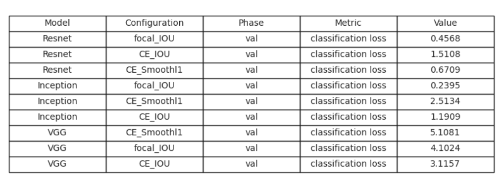

# MNIST_objectDetection

This repository contains a synthetic object detection dataset created using the MNIST data. The images from the MNIST dataset are resized and placed on a black canvas. The coordinates of the objects in the images are recorded and used as values for prediction.

## Dataset Preview

## Dataset Description

The dataset consists of images where multiple instances of MNIST digits are placed on a black canvas. Each image is annotated with the coordinates of the objects present in the image. These annotations can be used for training and evaluating object detection models.

## Models
The dataset has been tested on the following models:
- VGG
- GoogLeNet
- ResNet

We trained the models with three different loss functions:
- Cross Entropy (CE) and Focal for classification
- Intersection over Union (IOU) and Smooth L1 for bounding box regression.

## Results
The performance of the object detection models on the MNIST_objectDetection dataset is shown below:

### Bounding Box Regression Results

### Classification Results
